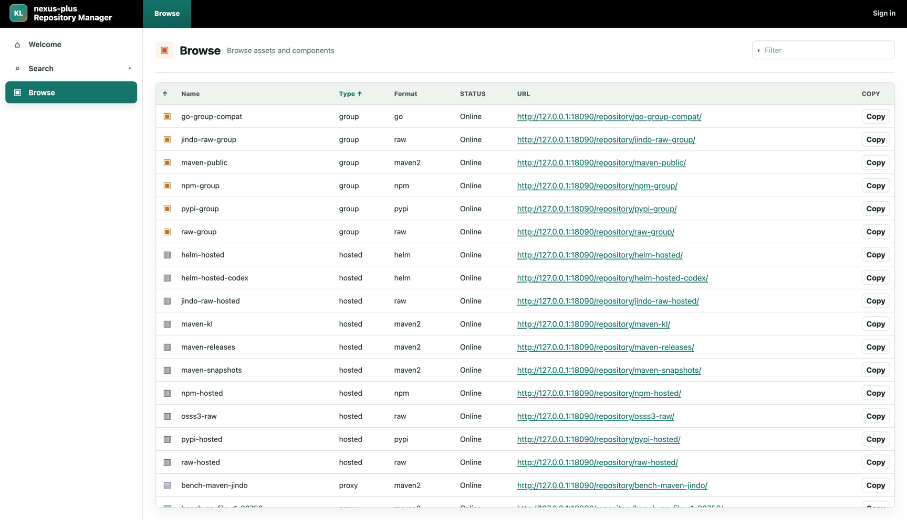
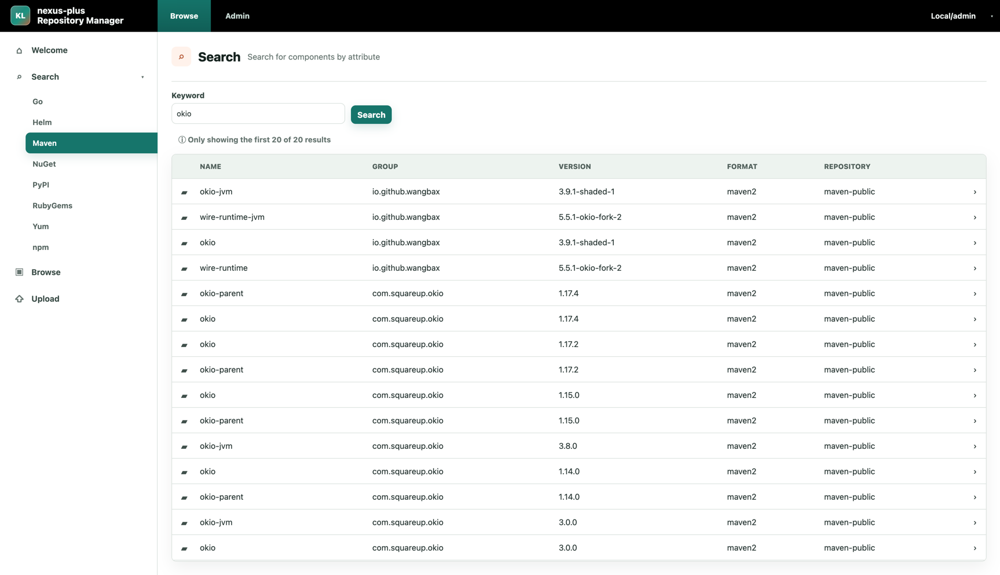
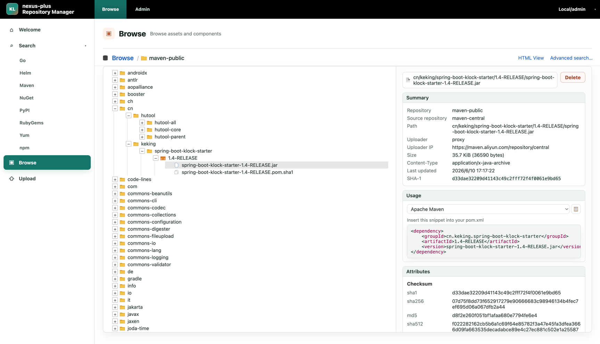
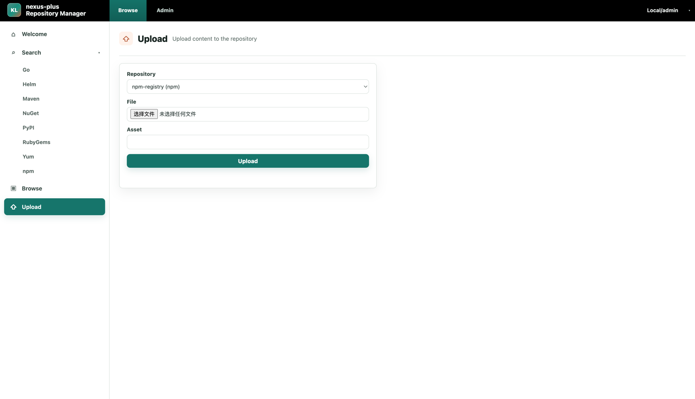
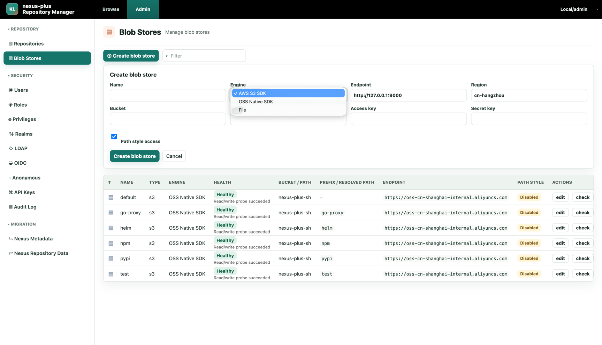
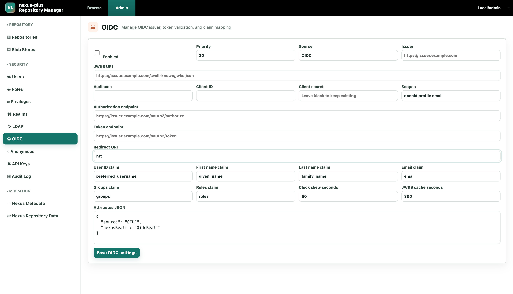
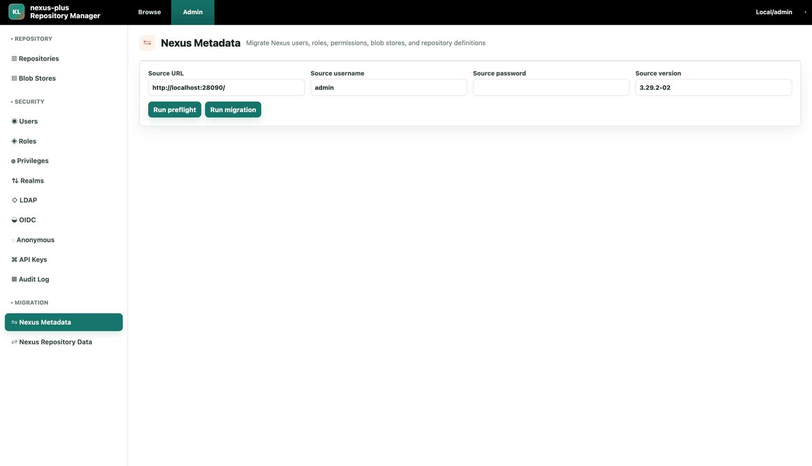
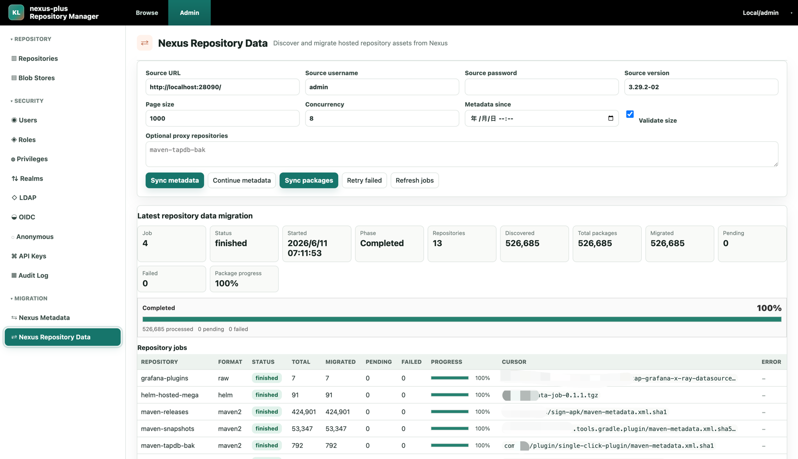

# nexus-plus

[](https://github.com/klboke/nexus-plus/actions/workflows/ci.yml)
[](https://github.com/klboke/nexus-plus/releases)
[](LICENSE)
[](https://github.com/klboke/nexus-plus/pkgs/container/nexus-plus)
[](SECURITY.md)

`nexus-plus` 是一个兼容 Nexus 的自托管制品仓库，面向 Maven、npm、PyPI、Go、Helm、NuGet、RubyGems、Yum 和 Raw 制品。

项目目标是在保持 Nexus 客户端协议、权限认证模型和 `/repository/<repo>/...` URL 布局兼容的同时，解决 Nexus Repository OSS / Community Edition 在内嵌数据库稳定性、外部数据库支持、多副本部署和用量限制上的问题，并支持从存量 Nexus 平滑迁移到 nexus-plus：

- 基于 Java 和 Spring Boot 的服务
- MySQL 元数据和身份数据
- MySQL 协调状态 + 进程内 TTL 缓存
- OSS/S3/File blob 存储
- 兼容 Nexus 的 `/repository/<repo>/...` 协议入口,兼容 Nexus 的权限模型
- 面向现有 Nexus 实例的一键迁移工具, 0 停机从 Nexus 迁移到 nexus-plus
- `/admin/` 下的轻量运维管理控制台
- `/browse/` 下的用户侧仓库浏览器

## 快速开始

使用公开发行镜像和 MySQL 在本地启动一个试用环境：

```bash
curl -fsSL https://raw.githubusercontent.com/klboke/nexus-plus/main/scripts/quickstart.sh | bash
```

启动后访问：

- 管理控制台：`http://127.0.0.1:19090/admin/`
- 用户侧浏览器：`http://127.0.0.1:19090/browse/`
- 健康检查：`http://127.0.0.1:19091/actuator/health`

首次进入页面时，在 UI 中创建初始 `Local/admin` 管理员密码。quickstart 使用 File blob storage 作为本地试用存储；生产环境请改用 OSS/S3，并替换为自己的加密密钥。

如果希望先检查脚本内容，可以先下载 `scripts/quickstart.sh`，确认后再用 `bash` 执行。

## 构建和部署

本地快速启动、Spring Boot 可执行 jar、Docker 镜像、压缩包、生产部署架构、资源规格和升级流程见 [构建部署指南](docs/zh/build-deployment-guide.md)。

本地开发热重载和测试说明见 [中文开发指南](docs/zh/development-guide.md)。

## 支持能力

| 格式 | 仓库类型 | 客户端发布/上传 | 浏览和搜索 | Nexus 迁移 |
| --- | --- | --- | --- | --- |
| Maven | hosted / proxy / group | 支持 Maven deploy、PUT 上传和管理台上传 | 支持 | 默认迁移 hosted；proxy 可作为可选仓库迁移 |
| npm | hosted / proxy / group | 支持 `npm publish`、dist-tag 和管理台上传 | 支持 | 默认迁移 hosted；proxy 可作为可选仓库迁移 |
| PyPI | hosted / proxy / group | 支持 twine 上传和管理台上传 | 支持 simple index | 默认迁移 hosted；proxy 可作为可选仓库迁移 |
| Go | proxy / group | Go module proxy 以只读代理为主，不支持 hosted 上传 | 支持 | proxy 可作为可选仓库迁移 |
| Helm | hosted / proxy | 支持 chart push、PUT 上传和管理台上传 | 支持 index.yaml | 默认迁移 hosted；proxy 可作为可选仓库迁移 |
| NuGet | hosted / proxy / group | 支持 package push 和管理台上传 | 支持 v3 service index / search | 默认迁移 hosted；proxy 可作为可选仓库迁移 |
| RubyGems | hosted / proxy / group | 支持 gem push/yank 和管理台上传 | 支持 | 默认迁移 hosted；proxy 可作为可选仓库迁移 |
| Yum | hosted / proxy / group | 支持 RPM 上传和管理台上传 | 支持 repodata | 默认迁移 hosted；proxy 可作为可选仓库迁移 |
| Raw | hosted / proxy / group | 支持 PUT 上传和管理台上传 | 支持 | 默认迁移 hosted；proxy 可作为可选仓库迁移 |

Nexus Repository Data 迁移默认扫描 hosted 仓库；如需迁移源 Nexus 中作为历史备份或回源缓存使用的 proxy 仓库，可以在迁移页面的 `Optional proxy repositories` 中显式指定仓库名。

## 从 Nexus 迁移

迁移入口在管理控制台 `/admin/`：

1. 在源 Nexus 开启 Script REST API 脚本创建能力。
2. 在 `Nexus Metadata` 页面先执行 `Run preflight`，确认无阻塞问题后执行 `Run migration`。
3. 在 `Nexus Repository Data` 页面先执行 `Sync metadata` 迁移仓库元数据，再执行 `Sync packages` 迁移 blob 真实数据。
4. 首次仓库数据迁移时 `Metadata since` 保持为空，扫描全量数据；后续迁移可以指定 `Metadata since` 做增量。
5. 迁移完成后，把原 Nexus 域名指向 nexus-plus，客户端配置无需修改。

迁移支持中断后继续，已迁移完成的数据会跳过。完整流程见 [Nexus 迁移说明](docs/zh/nexus-migration-guide.md)。

## 与开源版 Nexus 对比

| 维度 | Nexus Repository OSS / Community Edition | nexus-plus                                                                                                        |
| --- | --- |-------------------------------------------------------------------------------------------------------------------|
| 产品定位 | 通用制品仓库管理平台，功能完整，覆盖大量官方格式和管理能力 | 在保持 Nexus 客户端行为、权限模型和 `/repository/<repo>/...` URL 布局兼容的同时，解决 OSS 内嵌数据库稳定性、Community Edition 用量限制、开源版多副本横向扩容不足的问题，并提供 0 停机迁移到 nexus-plus 的能力 |
| 支持格式 | 官方支持格式更多，具体能力随版本和发行形态变化 | 聚焦常用制品格式，当前支持 Maven、npm、PyPI、Go、Helm、NuGet、RubyGems、Yum 和 Raw；每个格式以独立 protocol 模块实现，便于按优先级扩展和验证                       |
| 使用限制 | Community Edition 面向个人和小团队，官方限制为最多 40,000 components、100,000 requests/day；超过阈值后会暂停新增 component，直到用量回到限制以下 | 不内置 Community Edition 这类版本授权用量限制；容量边界由 MySQL、OSS/S3、运行副本数和部署规格决定，适合按实际业务规模扩容                                      |
| 高可用部署 | 开源版适合单实例或基础 Kubernetes 部署；官方 HA deployment 属于 Pro 能力 | 从设计上默认支持多副本：session、认证 ticket、catalog 水位、锁、迁移进度和短生命周期协同状态都落 MySQL，进程内缓存只作为可重建热缓存                                  |
| 稳定性和升级 | 版本边界复杂：3.70.x 是最后支持 OrientDB 的版本；3.71.0 起新安装默认 H2，但 H2 仍是内嵌数据库；Community Edition 到 3.77.0+ 才支持免费使用外部 PostgreSQL；3.88.0 起搜索才完全改为 SQL、替代 Elasticsearch。旧版 OrientDB/Elasticsearch/本地数据目录组合升级窗口重，文件损坏后恢复高度依赖备份、修复任务和人工介入 | 运行时直接 MySQL-first，不依赖 OrientDB 和内嵌 Elasticsearch；核心状态在 MySQL，blob 在 OSS/S3/File blob store，缓存和索引均可重建，更适合滚动升级、故障切换和数据恢复 |
| 元数据存储 | 版本演进中经历 OrientDB、H2、PostgreSQL 等存储迁移路径，历史实例升级需要处理数据库迁移约束 | MySQL-first：仓库、组件、asset、权限、token、审计、迁移状态和可重建索引都使用显式表结构，便于排查、治理和横向扩展                                               |
| blob 存储 | 常见部署使用本地文件 blob store，也可按版本和配置使用对象存储能力 | OSS/S3-first，同时保留 File blob store 用于开发测试；MySQL 只保存元数据、状态、索引和引用，不把大 blob 放进数据库                                     |
| 搜索和索引 | 3.88.0 之前的 Nexus 搜索和索引基于内嵌 Elasticsearch，索引文件和数据库状态分离；索引损坏或不一致时需要依赖 Nexus 修复/重建任务处理 | 使用 MySQL 反范式索引和协议派生元数据，browse/search/index 都按可重建数据设计，节点丢缓存不影响正确性                                                  |
| 架构复杂度 | Nexus 功能复杂，覆盖大量通用管理能力和历史架构机制 | nexus-plus 架构简单，只聚焦仓库管理和客户端协议实现                                                                                   |

## 选型建议

- 如果公司业务量非常小，仓库包数量和访问量都在 Community Edition 限制内，并且可以接受偶尔停机维护，建议优先使用 Nexus 开源版本。
- 如果对稳定性、扩展性和多副本部署要求较高，或者需要管理的包数量非常多，建议使用 nexus-plus。
- 如果存量 Nexus 在升级到新的 Community Edition 版本时遇到组件数量或日请求量限制问题，欢迎使用 nexus-plus 的一键迁移功能，0 停机迁移到 nexus-plus。

## UI 展示

### 前台

前台面向制品使用者，提供仓库列表、包搜索、目录浏览、制品详情和上传入口。

仓库列表展示 hosted、proxy、group 仓库的格式、状态和访问 URL，便于用户直接复制客户端配置地址。



按格式搜索组件，支持 Maven、npm、PyPI、Go、Helm、NuGet、RubyGems、Yum 和 Raw 等仓库类型的制品检索。



目录浏览展示仓库路径树、制品摘要、checksum、content-type、更新时间和客户端使用片段。



上传页面提供按仓库选择文件和 asset path 的入口，用于 hosted 仓库的手工制品发布。



### 后台

后台面向仓库管理员，聚焦仓库配置、存储健康、安全配置、审计和 Nexus 迁移。

Blob Store 页面支持 OSS Native SDK、AWS S3 SDK 和 File 引擎配置，并展示读写探测健康状态。



OIDC 页面管理 issuer、JWKS、client、scope、claim 映射和 token 校验参数，便于接入统一身份系统。



Nexus Metadata 迁移入口用于迁移用户、角色、权限、blob store 和 repository 定义，并支持 preflight。



Nexus Repository Data 迁移页面展示 hosted 仓库数据迁移任务、并发参数、进度统计、失败数量和仓库级明细。



AI agent 和贡献者的开发说明见 [AGENTS.md](AGENTS.md)。

## 路线图

后续仓库格式迭代路线：

1. Docker / OCI Registry - 进行中（[开发计划](docs/zh/dev/docker-repository-implementation-plan.md)）
2. APT / Debian
3. Cargo / Rust
4. Terraform Provider / Module Registry
5. Conan
6. Conda
7. Composer / PHP

协议和客户端兼容性待办：

- RubyGems Bearer/API-key 凭据示例：客户端兼容性验证完成后补充。

## 参与贡献

欢迎提交 issue 和 pull request。贡献流程、PR 要求、兼容性测试要求和多副本设计约束见 [CONTRIBUTING.md](CONTRIBUTING.md)。社区行为准则见 [CODE_OF_CONDUCT.md](CODE_OF_CONDUCT.md)。

本地开发和测试说明见 [中文开发指南](docs/zh/development-guide.md)；构建部署说明见 [构建部署指南](docs/zh/build-deployment-guide.md)；AI agent 和贡献者约束见 [AGENTS.md](AGENTS.md)。

## 支持

加入 [nexus-plus Telegram 群](https://t.me/+M6prtFUGnF9kYTU1) 获取社区支持和使用交流。Issue 分类、支持范围和安全问题报告边界见 [SUPPORT.md](SUPPORT.md)。

## 安全

如果发现安全问题，请按 [SECURITY.md](SECURITY.md) 说明优先通过 GitHub Security Advisory 报告，避免在公开 issue 中直接披露可利用细节。普通 bug、兼容性问题和功能建议可以直接提交 issue。

## 许可证

nexus-plus 使用 [Apache License 2.0](LICENSE) 开源。

## 文档

- [中文开发指南](docs/zh/development-guide.md)
- [构建部署指南](docs/zh/build-deployment-guide.md)
- [客户端配置示例](docs/zh/client-recipes.md)
- [架构说明](docs/zh/architecture.md)
- [兼容性矩阵](docs/zh/compatibility-matrix.md)
- [排障指南](docs/zh/troubleshooting.md)
- [生产加固指南](docs/zh/production-hardening.md)
- [备份恢复指南](docs/zh/backup-restore.md)
- [安全模型](docs/zh/security-model.md)
- [MySQL ER 设计](docs/zh/mysql-er.md)
- [Nexus 迁移说明](docs/zh/nexus-migration-guide.md)
- [Nexus 迁移实战手册](docs/zh/migration-playbook.md)
- [监控观测指南](docs/zh/monitoring-observability-guide.md)
- [Nexus 兼容性测试说明](docs/zh/nexus-compatibility-testing.md)
- [FAQ](docs/zh/faq.md)
- [为什么开发 nexus-plus 替换 Nexus](docs/zh/why-nexus-plus.md)
- [Changelog](CHANGELOG.md)
