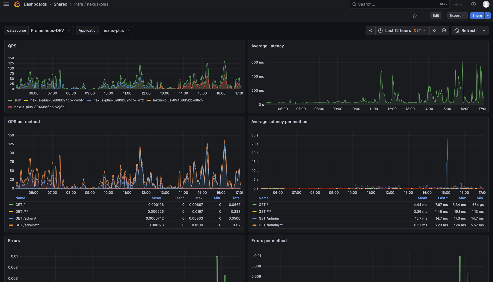
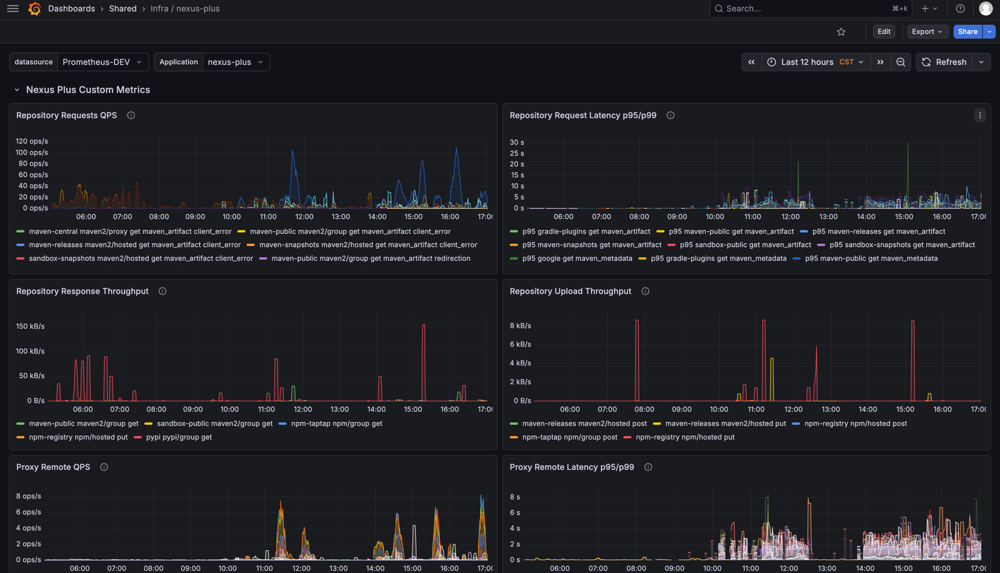
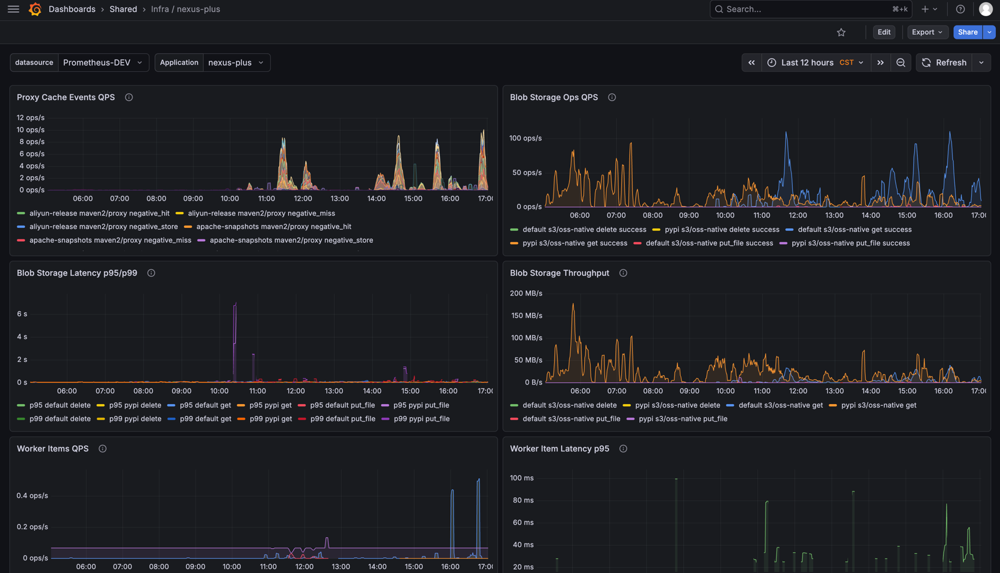

# Monitoring And Observability Guide

This document describes kkrepo health checks, Prometheus metrics, Grafana dashboards, and common alerting recommendations.

## Exposed Ports

kkrepo exposes health checks and metrics through Spring Boot Actuator.

| Scenario | Service port | Management port | Description |
| --- | --- | --- | --- |
| Default runtime | `8080` | `8081` | Management port can be overridden by `KKREPO_MANAGEMENT_PORT` |
| Local `dev` profile | `18090` | `18091` | Default ports used by `scripts/dev.sh` |

Common endpoints:

```text
/actuator/health
/actuator/metrics
/actuator/prometheus
```

Local verification:

```bash
curl -sS http://127.0.0.1:8081/actuator/health
curl -sS http://127.0.0.1:8081/actuator/prometheus | head
```

If the development script is used, change the port to `18091`.

## Prometheus Integration

Prometheus scrapes `/actuator/prometheus` on the management port:

```yaml
scrape_configs:
  - job_name: kkrepo
    metrics_path: /actuator/prometheus
    static_configs:
      - targets:
          - kkrepo:8081
```

In Kubernetes, add Prometheus scrape annotations to the Pod or Service:

```yaml
prometheus.io/scrape: "true"
prometheus.io/port: "8081"
prometheus.io/path: "/actuator/prometheus"
```

If Prometheus Operator is used, scrape the management port with a `ServiceMonitor`:

```yaml
apiVersion: monitoring.coreos.com/v1
kind: ServiceMonitor
metadata:
  name: kkrepo
spec:
  selector:
    matchLabels:
      app: kkrepo
  endpoints:
    - port: management
      path: /actuator/prometheus
      interval: 30s
```

Metrics include the `application` label by default. Its value comes from `spring.application.name`, which is `kkrepo` by default. For multi-environment deployments, keep labels such as `namespace`, `pod`, and `instance` on the Prometheus side so you can troubleshoot by environment and replica.

## Grafana Dashboard

Bundled Grafana dashboard:

```text
docs/resources/grafana/dashboard.json
```

Import steps:

1. Open Grafana.
2. Go to `Dashboards` -> `New` -> `Import`.
3. Upload `docs/resources/grafana/dashboard.json`.
4. Select any Prometheus data source.
5. Select `application` at the top of the dashboard. It matches `kkrepo` application labels by default.

The dashboard uses a generic Prometheus data source variable and is not bound to a specific `Prometheus-DEV` data source name.

### Dashboard Preview

Overall HTTP requests, QPS, latency, and error overview:



Repository requests, proxy remote access, and blob storage metrics:



Background tasks, rebuild queues, GC, and rate-limit metrics:



## Key Metrics

### HTTP And Repository Requests

| Metric | Type | Description |
| --- | --- | --- |
| `http_server_requests_seconds_*` | Spring Boot timer | HTTP request latency and count |
| `kkrepo_repository_requests_total` | counter | Repository protocol request count |
| `kkrepo_repository_request_duration_seconds_*` | timer | Repository protocol request latency |
| `kkrepo_repository_upload_bytes_total` | counter | Uploaded request body bytes |
| `kkrepo_repository_response_bytes_total` | counter | Response bytes |

Common labels:

- `repo`: repository name
- `format`: artifact format, such as `maven2`, `npm`, `pypi`
- `type`: repository type, such as `hosted`, `proxy`, `group`
- `method`: HTTP method
- `operation`: protocol operation
- `status`: HTTP status code
- `outcome`: request outcome, such as `success`, `client_error`, `server_error`, `error`

### Proxy Remote Access

| Metric | Type | Description |
| --- | --- | --- |
| `kkrepo_proxy_remote_requests_total` | counter | Upstream request count for proxy repositories |
| `kkrepo_proxy_remote_duration_seconds_*` | timer | Upstream request latency for proxy repositories |
| `kkrepo_proxy_cache_events_total` | counter | Proxy cache hit, miss, negative cache, and similar events |

Focus on `remote_host`, `status`, and `outcome`. If package pulls from a proxy repository become slow, check upstream latency and upstream errors first.

### Blob Storage

| Metric | Type | Description |
| --- | --- | --- |
| `kkrepo_blob_storage_operations_total` | counter | Blob storage operation count |
| `kkrepo_blob_storage_operation_duration_seconds_*` | timer | Blob storage operation latency |
| `kkrepo_blob_storage_bytes_total` | counter | Blob read/write bytes |

Common labels:

- `store`: blob store name
- `type`: blob store type
- `engine`: storage engine, such as `oss-native`, `s3`, `file`
- `op`: operation, such as `put`, `get`, `get_range`, `delete`
- `outcome`: `success`, `miss`, `error`

### Docker / OCI

Docker / OCI also emits repository request and blob storage metrics with
`format="docker"`. Additional Docker-specific metrics are:

| Metric | Type | Description |
| --- | --- | --- |
| `kkrepo_docker_upload_sessions_total` | counter | Docker upload session operations, labeled by action and outcome |
| `kkrepo_docker_blob_mount_total` | counter | Cross-repository blob mount attempts |
| `kkrepo_docker_cache_events_total` | counter | Docker manifest/blob/tag/group/negative-cache events |
| `kkrepo_docker_digest_verifications_total` | counter | Upload/proxy/blob digest verification results |
| `kkrepo_docker_cleanup_items_total` | counter | Items deleted or handled by Docker cleanup policies |
| `kkrepo_docker_referrers_total` | counter | OCI referrers API response count |
| `kkrepo_docker_referrer_descriptors_total` | counter | OCI referrer descriptors returned |
| `kkrepo_docker_uploads_active` | gauge | Active Docker upload requests |
| `kkrepo_docker_downloads_active` | gauge | Active Docker blob download requests |
| `kkrepo_docker_uploads_limit` | gauge | Configured Docker upload concurrency limit |
| `kkrepo_docker_downloads_limit` | gauge | Configured Docker blob download concurrency limit |

For Docker proxy repositories, upstream registry calls are recorded through
`kkrepo_proxy_remote_*` with `format="docker"`, including token requests and
redirect hops.

### Background Tasks And Queues

| Metric | Type | Description |
| --- | --- | --- |
| `kkrepo_worker_items_total` | counter | Number of items processed by background workers |
| `kkrepo_worker_item_duration_seconds_*` | timer | Time spent processing a single item |
| `kkrepo_worker_batch_duration_seconds_*` | timer | Time spent processing a worker batch |
| `kkrepo_metadata_rebuild_backlog` | gauge | Maven metadata rebuild backlog |
| `kkrepo_metadata_rebuild_oldest_age_seconds` | gauge | Wait time of the oldest Maven metadata rebuild task |
| `kkrepo_metadata_rebuild_failures` | gauge | Maven metadata rebuild failure backlog |
| `kkrepo_repository_index_rebuild_backlog` | gauge | Repository index rebuild backlog |
| `kkrepo_repository_index_rebuild_oldest_age_seconds` | gauge | Wait time of the oldest repository index rebuild task |
| `kkrepo_repository_index_rebuild_failures` | gauge | Repository index rebuild failure backlog |

If browse/search or protocol metadata is not updated for a long time, check backlog, oldest age, and failures first.

### Blob GC

| Metric | Type | Description |
| --- | --- | --- |
| `kkrepo_blob_gc_backlog` | gauge | Number of soft-deleted blobs waiting for GC |
| `kkrepo_blob_gc_deleted_bytes_total` | counter | Blob bytes deleted by GC |
| `kkrepo_blob_gc_reconcile_scanned_total` | counter | Rows scanned by orphan blob reconcile |
| `kkrepo_blob_gc_reconcile_marked_total` | counter | Orphan blobs marked by reconcile |
| `kkrepo_blob_unreferenced_reconcile_cursor` | gauge | Orphan blob reconcile scan cursor |

### Shared Cache And Rate Limiting

| Metric | Type | Description |
| --- | --- | --- |
| `kkrepo_cache_requests_total` | counter | Shared TTL cache request count |
| `kkrepo_cache_operation_duration_seconds_*` | timer | Cache operation latency |
| `kkrepo_cache_scan_deleted_keys_total` | counter | Number of cache keys deleted by prefix scan |
| `kkrepo_rate_limit_blocked_total` | counter | Number of requests blocked by rate limiting |

## Alert Recommendations

The following PromQL rules are starting points only. Production thresholds should be adjusted based on business traffic and repository scale.

### Instance Not Scrapeable

```promql
up{job="kkrepo"} == 0
```

### Repository Request 5xx

```promql
sum(rate(kkrepo_repository_requests_total{outcome="server_error"}[5m])) > 0
```

### Repository Request Latency Too High

```promql
histogram_quantile(
  0.95,
  sum(rate(kkrepo_repository_request_duration_seconds_bucket[5m])) by (le, repo, method, operation)
) > 2
```

### Proxy Upstream Errors

```promql
sum(rate(kkrepo_proxy_remote_requests_total{outcome=~"server_error|error"}[5m])) by (repo, remote_host) > 0
```

### Blob Storage Errors

```promql
sum(rate(kkrepo_blob_storage_operations_total{outcome="error"}[5m])) by (store, engine, op) > 0
```

### Background Queue Backlog

```promql
kkrepo_metadata_rebuild_oldest_age_seconds > 300
or
kkrepo_repository_index_rebuild_oldest_age_seconds > 300
```

### Rate Limit Blocks

```promql
sum(rate(kkrepo_rate_limit_blocked_total[5m])) by (type) > 0
```

## Log Troubleshooting

Repository requests with non-success status are logged by default. Control this with:

```properties
kkrepo.repository.log-non-success-requests=true
kkrepo.repository.log-non-success-request-excluded-statuses=477,488
```

Corresponding environment variables:

```bash
KKREPO_REPOSITORY_LOG_NON_SUCCESS_REQUESTS=true
KKREPO_REPOSITORY_LOG_NON_SUCCESS_REQUEST_EXCLUDED_STATUSES=477,488
```

Troubleshooting suggestions:

- Slow package pulls: check `Repository Request Latency`, then `Proxy Remote Latency` and `Blob Storage Latency`.
- Proxy repository failures: check `remote_host`, `status`, and `outcome` on `kkrepo_proxy_remote_requests_total`.
- Slow or failed uploads: check `kkrepo_repository_upload_bytes_total`, blob `put` latency, and blob `error`.
- browse/search not updating: check metadata/index rebuild backlog and failures.
- Many 401/403 responses: investigate with security audit logs and repository permission configuration.

## FAQ

### `/actuator/prometheus` Returns 404

Make sure you are accessing the management port, not the service port. The default management port is `8081`; the local `dev` profile uses `18091`.

### Grafana Has No Data

First confirm the Prometheus target is `UP`, then check the dashboard data source and `application` variable. kkrepo uses `kkrepo` as the default `application` label.

### Only Partial Data Is Visible In Multi-Replica Deployment

Make sure Prometheus scrapes the management port of every replica and keeps `instance`, `pod`, or equivalent labels. Aggregation queries usually need to aggregate by business labels while preserving replica dimensions for single-replica troubleshooting.
