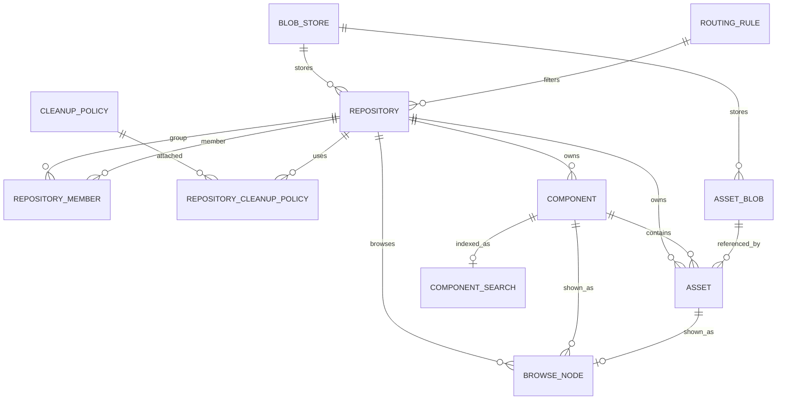
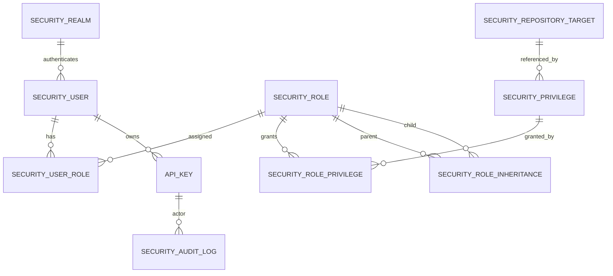
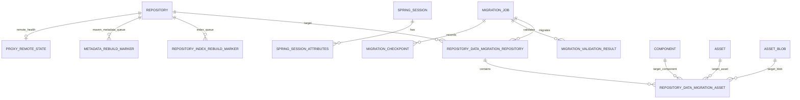

# nexus-plus MySQL ER Design

The current MySQL schema is defined by `server/src/main/resources/db/migration/V1__init_schema.sql` through `V24__remove_legacy_oss_accelerator_engine.sql`, and is executed by Flyway during service startup. The target database is MySQL 8 InnoDB.

The first version continues to use a "unified content table + format field" model instead of creating physical tables per format for Maven/npm/PyPI/Go/Helm/Yum/RubyGems/NuGet. This is more suitable for migration from Nexus and unified admin-console queries. If a specific format becomes significantly larger later, it can be optimized with partitioning or dedicated tables.

## Repository And Content ER

## Security And Audit ER

Except for role/privilege mapping tables, the lines involving `security_realm`, `security_repository_target`, `api_key`, and `security_audit_log` describe runtime business relationships. Actual hard foreign keys are defined by Flyway migrations. The audit table does not create foreign keys to actor/token data, so audit records are not affected by account or token lifecycle cascades.

## Runtime Coordination And Migration ER

`cache_version`, `auth_ticket`, and `maintenance_cursor` are runtime coordination tables read and written independently by primary key, so they do not attach business foreign keys.

## Table Layers

### Repository Configuration Layer

| Table | Responsibility |
| --- | --- |
| `blob_store` | Logical definition of OSS/S3/File blob stores. Keeps raw attributes JSON and extracts common fields such as endpoint/bucket/prefix |
| `repository` | hosted/proxy/group repository definition. Keeps Nexus recipe and attributes JSON, and explicitly stores format, type, online, remote URL, and similar fields |
| `repository_member` | Member order for group repositories. Nexus group semantics depend on order, so it must be preserved. Group repositories also have a blob store |
| `routing_rule` | proxy routing rule |
| `cleanup_policy` | raw cleanup policy conditions |
| `repository_cleanup_policy` | Binding between repository and cleanup policy |
| `content_selector` | Early content selector configuration table. Runtime authorization currently uses CSEL/target definitions in `security_repository_target` |

### Content Metadata Layer

| Table | Responsibility |
| --- | --- |
| `component` | Package-level metadata. All artifact formats are unified here, and `format` stores the Nexus protocol format name |
| `asset` | Downloadable object or protocol metadata file, such as jar, pom, tarball, simple index, or index.yaml |
| `asset_blob` | Physical blob reference and checksum. `deleted_at/delete_reason/delete_claimed_at` support soft delete, GC claim, and blob store usage statistics |
| `browse_node` | Tree view for the Browse page. It can be rebuilt from `asset`, but keeping a copy improves UI query experience. `has_asset_subtree` helps large repository directory queries |
| `component_search` | Denormalized SQL Search index table. It replaces the old Nexus local Elasticsearch approach |

### Runtime Coordination Layer

| Table | Responsibility |
| --- | --- |
| `proxy_remote_state` | Remote health state and failure count for proxy repositories, used as shared circuit-breaker state across replicas |
| `metadata_rebuild_marker` | Maven metadata asynchronous rebuild queue, deduplicated by `(repository_id, scope_key)`. Workers claim tasks concurrently with `FOR UPDATE SKIP LOCKED` |
| `repository_index_rebuild_marker` | Repository-level or scoped index rebuild queue for Helm/PyPI/Yum/RubyGems and similar formats, with failure count and error summary |
| `cache_version` | MySQL version watermark. Node-local cache is only hot cache. After changes, bump the version so other replicas poll, invalidate, and reload |
| `SPRING_SESSION` | Spring Session JDBC main table for cross-replica HTTP sessions |
| `SPRING_SESSION_ATTRIBUTES` | Spring Session attribute table |
| `auth_ticket` | Short-lived authentication ticket, stored by token hash and cleaned by expiration time |
| `maintenance_cursor` | Shared cursor for background maintenance tasks, such as blob reconcile scan watermarks |

### Permission Layer

| Table | Responsibility |
| --- | --- |
| `security_user` | User and password hash. `(source, user_id)` preserves Nexus realm/source semantics. Local source is currently normalized to `Local` |
| `security_role` | Role definition. `source` preserves UI/migration semantics. Local roles are currently normalized to `Local` |
| `security_privilege` | Privilege definition. `properties_json` preserves Nexus privilege attributes. `read_only` marks built-in contributor privileges |
| `security_role_privilege` | Role-to-privilege mapping |
| `security_role_inheritance` | Role inheritance |
| `security_user_role` | User-to-role mapping |
| `security_anonymous_config` | Anonymous access configuration. Preserves Nexus enabled, userId, realmName, and stores mapped `user_source` |
| `security_realm_config` | Nexus realm order configuration |
| `security_realm` | Enabled state, name, priority, and provider attributes for local, LDAP, and OIDC realms |
| `security_repository_target` | Content selector / repository target compatibility definition, used at runtime for CSEL expression matching in repository-content-selector privileges |
| `api_key` | API key compatibility data. Uses `domain + api_key_hash` to align with Nexus uniqueness semantics. Raw tokens are stored only as encrypted payloads |
| `security_audit_log` | Audit log for admin API and security-related operations, indexed by time, actor, path, outcome/status, and method |

### Migration Layer

| Table | Responsibility |
| --- | --- |
| `migration_job` | Input, options, state, and summary for one migration job |
| `migration_checkpoint` | Mapping from OrientDB RID to target table primary key, used for resume and idempotent import |
| `migration_validation_result` | Count, checksum, and sampled protocol validation result |
| `repository_data_migration_repository` | Repository-level progress, cursor, statistics, claim state, and options for repository data migration |
| `repository_data_migration_asset` | Asset-level task, retry state, source metadata, and target component/asset/blob references for repository data migration |

## Key Design Decisions

1. `component.coordinate_hash` is calculated by the application as SHA-256 over `repository + namespace + name + version`, solving MySQL long-string composite unique index limits.
2. `asset.path_hash` is calculated by the application from the protocol path inside the repository, expressing Nexus asset path uniqueness.
3. `asset_blob.blob_ref_hash` and `object_key_hash` are calculated by the application to avoid unique indexes on very long URLs/keys. `idx_asset_blob_reusable` supports blob reuse by sha256/size, and `idx_asset_blob_usage` supports blob store usage statistics.
4. `attributes_json` preserves raw Nexus attributes, while explicit columns support high-frequency queries. During migration, the first goal is to avoid losing information, then gradually converge the model.
5. `browse_node` and `component_search` are rebuildable tables. Migration failure in these tables does not affect protocol download correctness.
6. Metadata and repository index rebuild must be coordinated through MySQL marker queues, not a single JVM in-memory queue. Multi-replica workers claim tasks concurrently with `FOR UPDATE SKIP LOCKED`, and tasks remain idempotent.
7. Node-local catalog caches for permissions, repository directory data, blob stores, and similar state are only rebuildable hot caches. The shared source of truth is MySQL, and cross-replica invalidation uses the `cache_version` watermark.
8. HTTP sessions use Spring Session JDBC. `auth_ticket` only carries short-lived login/authentication flow state and does not replace session or token data.
9. The permission model is compatible with Nexus user/role/privilege semantics. Runtime repository authorization evaluates `nexus:repository-view:<format>:<repository>:<actions>`, `nexus:repository-admin:<format>:<repository>:<actions>`, `nexus:repository-content-selector:<selector>:<format>:<repository>:<actions>`, and repository target rules.
10. Maven repository format is stored as Nexus-native `maven2` in JSON, database, permissions, and CSEL. Historical `maven` values are normalized by V11.
11. Local security source currently uses `Local`; old `default` and Nexus realm names are normalized in migration and REST/UI compatibility layers.
12. Empty databases are seeded by V7/V9/V10 with Nexus 3.29.x built-in security contributor facts, including application management privileges, repository view/admin wildcard privileges, per-format/per-repository dynamic privileges, blob store privileges, the default anonymous user, and anonymous configuration. Idempotent inserts do not overwrite migrated or manually modified privileges with the same name.
13. `security_realm.attributes_json` carries external provider configuration: LDAP URL, bind DN, user/group search configuration, and OIDC issuer, JWKS, audience, clientId/clientSecret, authorization/token endpoint, redirect URI, scope, and claim mapping. After external realm authentication succeeds, external users are upserted by source, and LDAP/OIDC group names or token roles participate in permission evaluation as role names.
14. Anonymous access uses the identity and roles specified by `security_anonymous_config`; it does not bypass the permission model with a global read-only allow. Nexus default `NexusAuthorizingRealm/anonymous` maps to local `Local/anonymous`.
15. Migration is treated as a recoverable product feature: `migration_checkpoint` handles idempotent import of configuration/security objects, and `repository_data_migration_*` handles discover, claim, retry, resume, and progress statistics for repository asset data migration.
16. V24 normalizes historical `jindo` / `jindo-oss` blob store engines to `oss-native`. The source of truth for large blobs remains OSS/S3/File blob store; MySQL stores only metadata, state, indexes, and references.
